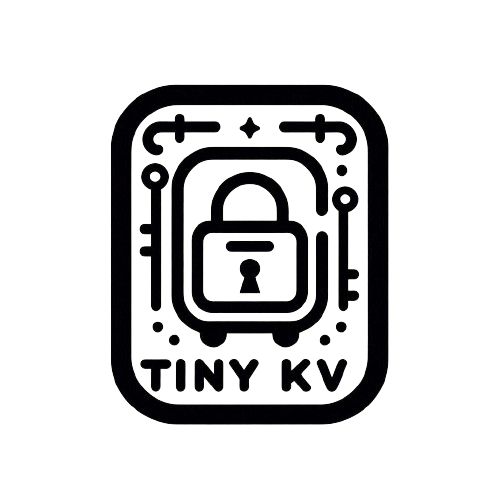

# TinyKV </a>


***This project is a toy project for myself to learn GoLang.***

TinyKV is a simple key-value store with RESTful API capabilities, built using [Golang](https://golang.org/).

## Features

- **Simple**: Provides a straightforward key-value storage solution.
- **RESTful API**: Access and manage key-value pairs using RESTful endpoints.
- **Lightweight**: Built with Golang for efficient performance and minimal resource usage.

## Installation

1. Clone the repository:

    ```bash
    git clone https://github.com/ronniesong0809/TinyKV.git
    ```

2. Navigate to the project directory:

    ```bash
    cd TinyKV
    ```

3. Build the project:

    ```bash
    go build
    ```

4. Run the executable:

    ```bash
    ./TinyKV
    ```

## Usage

- **Endpoints**:
    - `GET /kv/:key`: Retrieve the value for the specified key.
    - `POST /kv/:key`: Set a new key-value pair.
    - `PUT /kv/:key`: Update the value for an existing key.
    - `DELETE /kv/:key`: Delete a key-value pair.

- **Example**:
    - Set a key-value pair:
      ```bash
      curl -X POST http://localhost:3000/kv/exampleKey -H "Content-Type: application/json" -d '{"value": "exampleValue"}'
      ```

## Contributing

Contributions are welcome! Feel free to open an issue or submit a pull request for any improvements or new features.

## License

This project is licensed under the [MIT License](LICENSE).
